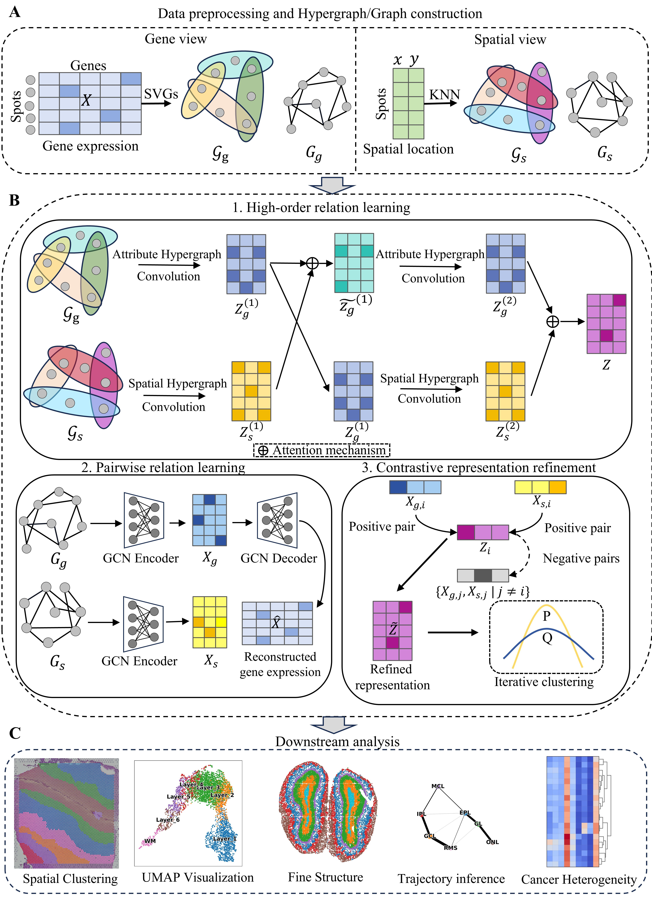

# HyperST
## Overview
HyperST: hypergraph learning with graph-guided contrastive refinement for spatial domain identification.


HyperST identifies spatial domains by learning low-dimensional embeddings from two complementary hypergraphs: a **spatial hypergraph** constructed from spatial coordinates using kNN and an **attribute hypergraph** constructed by feature reconstruction over spatially variable genes. These two views are integrated through cross-fusion and an attention mechanism. In addition, HyperST can leverage standard graph structure by introducing contrastive learning between hypergraph and graph views to enhance representation quality. Notably, for large-scale datasets, we do not recommend enabling the contrastive module due to memory constraints.

## Getting Started
### System Requirements

HyperST is implemented in **Python 3.9.19** and requires an R environment (**R 4.3.1**) for installing SPARK-X related dependencies.

### 1) Create and activate a conda environment

```bash
# Create environment (Python + R)
conda create -n HyperST python=3.9.19 r-base=4.3.1

# Activate environment
conda activate HyperST
```

### 2) Install dependencies

```bash
conda install r-essentials
conda install -c conda-forge pkg-config
pip install -r requirements.txt
```

### 3) (Optional) Register the environment as a Jupyter kernel

```bash
python -m ipykernel install --user --name HyperST
```

### 4) Install required R packages

> **Note:** Run the following commands in the R console.

```r
install.packages("devtools")
install.packages("remotes", repos = "https://cloud.r-project.org")

# Install mclust
remotes::install_version("mclust", version = "6.1.1", repos = "https://cloud.r-project.org")

# Install SPARK from GitHub
devtools::install_github("xzhoulab/SPARK")
```

## Tutorial

For a detailed demonstration of **HyperST**, please refer to the tutorial notebook:

* [**DLPFC_Tutorial.ipynb**](./DLPFC_Tutorial.ipynb)

This notebook provides a step-by-step guide on how to run the model.

> **Note:** Please replace `R_HOME` and `R_USER` with your local R installation paths before running.

### Large-scale Datasets (Stereo-seq / Slide-seqV2)

For large-scale datasets such as **Stereo-seq** and **Slide-seqV2**, we recommend using the sparse version of the model to optimize memory usage. 

Please initialize the model as follows:

```python
Hyper_model = HyperModel_Train_sparse(adata, H_gene, H_spatial, params=args, init=args.init)

## Data availability

All datasets used in this study are publicly available:

1. **Human dorsolateral prefrontal cortex (DLPFC)** dataset: http://spatial.libd.org/spatialLIBD.  
2. **Human breast cancer** dataset: https://support.10xgenomics.com/spatial-gene-expression/datasets/1.1.0.  
3. **Mouse olfactory bulb** dataset: https://github.com/JinmiaoChenLab/SEDR_analyses.  
4. **Mouse hippocampus** dataset: https://singlecell.broadinstitute.org/single_cell/study/SCP354/slide-seq-study.  
5. **Mouse visual cortex** dataset: https://www.dropbox.com/sh/f7ebheru1lbz91s/AADm6D54GSEFXB1feRy6OSASa/visual_1020/20180505_BY3_1kgenes?dl=0&subfolder_nav_tracking=1.  
6. **Mouse somatosensory cortex** dataset: https://linnarssonlab.org/osmFISH/.

